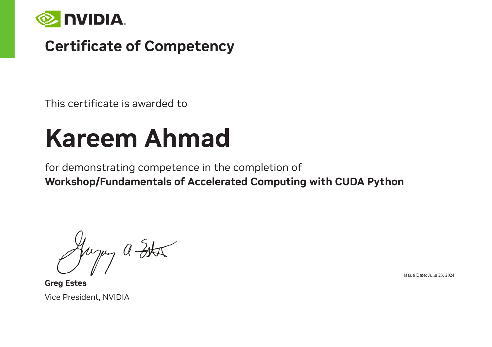
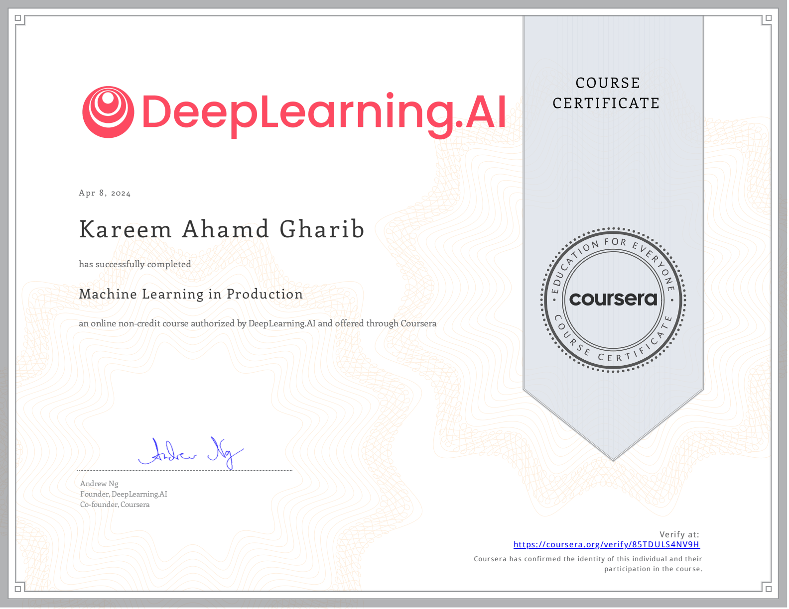
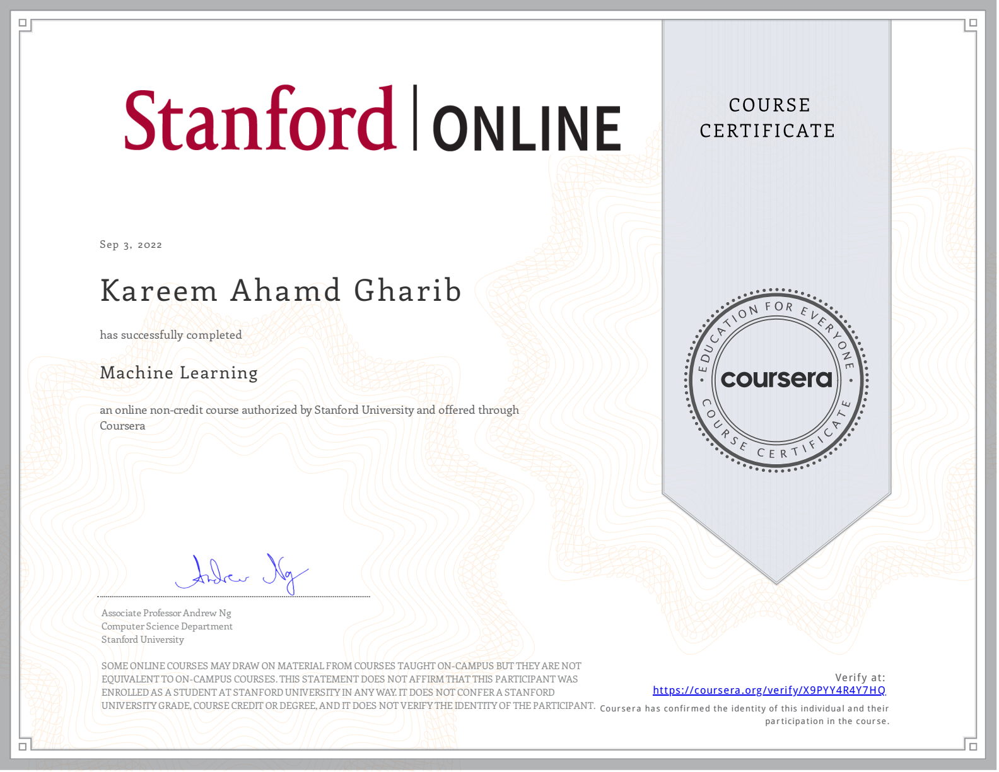
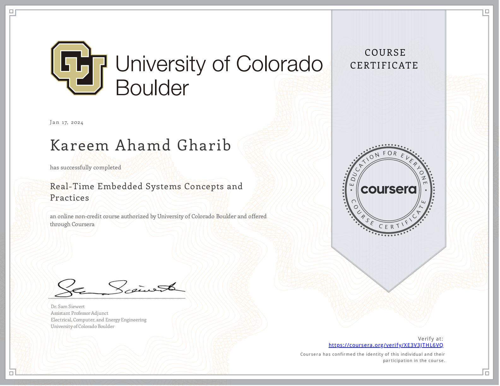
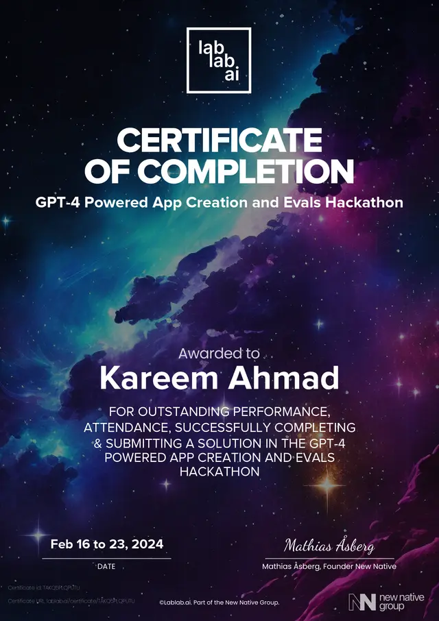
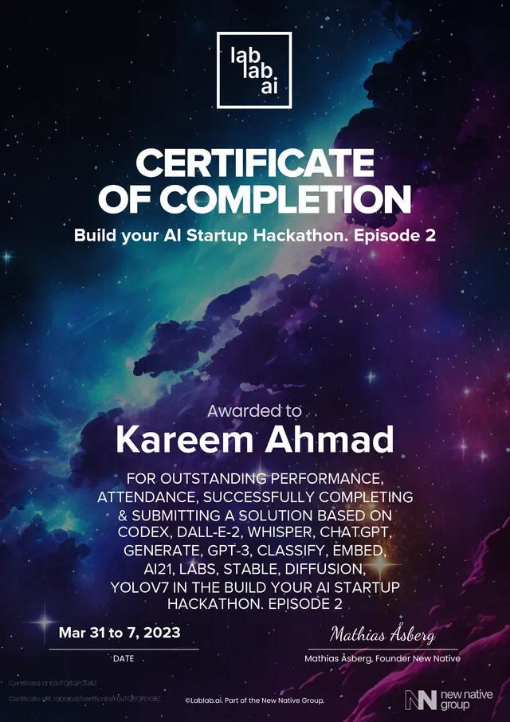
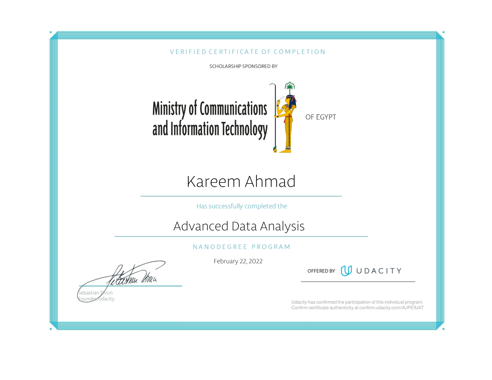
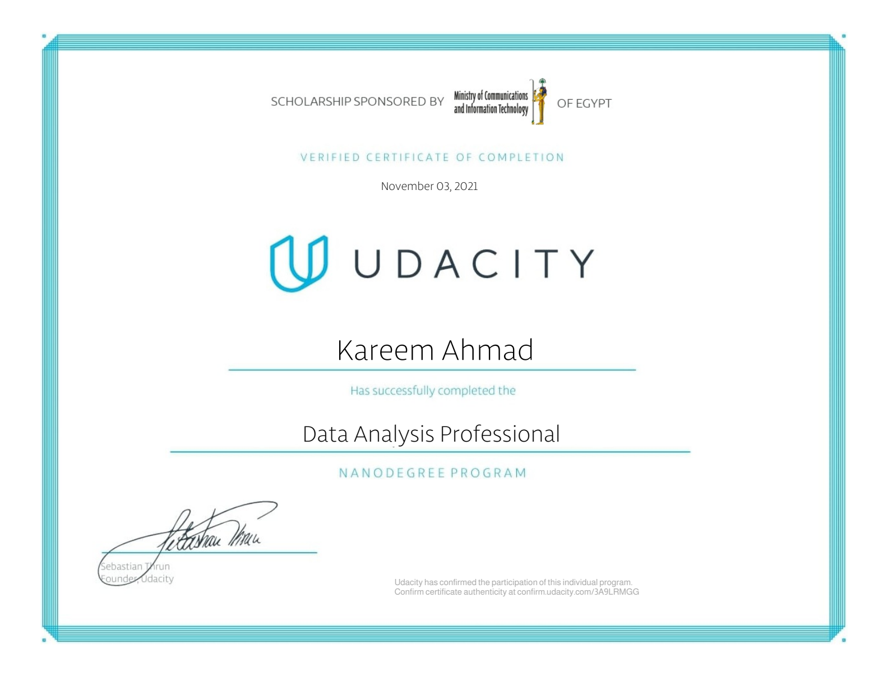

<div align="center">

# Kareem Mohammad


**Applied AI Engineer & Systems Architect**  
*Autonomous Agent Swarms &nbsp;·&nbsp; Low-Latency Distributed Caching &nbsp;·&nbsp; Zero-Trust Enterprise Infrastructure*

[](https://github.com/Kareem411)
[](https://kareem411.github.io/TriCache/)
[](https://www.npmjs.com/package/tricache)
[](https://www.voicase.me)
[-047857?style=flat-square&logo=target&logoColor=white)](#-workabix--distributed-enterprise-hris--applicant-tracking-system-in-development)
[](#-verified-credentials--accolades)

</div>

---

### 🏛️ Flagship Systems & Core Engineering

#### ⚡ [TriCache](https://github.com/Kareem411/TriCache) — Enterprise Three-Tier Distributed Caching Engine for Node.js
*High-throughput, multi-tier caching engine absorbing 95%+ of queries locally with warm in-memory reads at **2.81 million ops/sec (356 ns/op)**.*

**Eliminates costly database round-trips and Redis network saturation by absorbing 95%+ of hot read traffic in local RAM and off-heap POSIX memory before it touches the network.**

* **Three-Tier Storage Hierarchy**: Automatic cascading through **L1 RAM** (adaptive W-TinyLFU + Count-Min Sketch) $\rightarrow$ **L1.5 Off-Heap POSIX `/dev/shm` tmpfs & NVMe spill** $\rightarrow$ **L2 Clustered Redis/Valkey**.
* **Thundering-Herd Prevention**: In-process Singleflight promise coalescing eliminates duplicate DB queries under 10k-concurrency spikes, combined with background Stale-While-Revalidate (SWR) revalidation.
* **WASM & Mathematical Internals**: Inlined WebAssembly Murmur3 64-bit Bloom filters for zero-GC key-existence checks; zero-JSON MsgPack binary serialization reducing heap pressure by up to 68%.
* **Zero-Dependency Cloud Snapshots & Envelope Encryption**: Standalone AWS SigV4 signer for instant cold-start hydration from S3 / Cloudflare R2; AES-256-GCM / CTR envelope encryption with key-rotation fallbacks.
* **Turnkey Ecosystem Adapters**: Native modules for **Next.js 16/15** App Router (`cacheHandlers`), **NestJS** dynamic modules, **Prisma** `$extends`, **Drizzle ORM** `withCache`, **Express & Fastify** (RFC 7232 weak ETag & `304 Not Modified`), and zero-Node **Cloudflare Workers / Edge Isolates**.
* **Observability Suite**: Real-time SSE Web admin dashboard, Prometheus golden-signals text exporter, pre-built Grafana dashboards, and terminal top monitor (`npx tricache top`).

```
┌──────────────────────────────────────┬─────────────┬─────────────┬───────────────────────────┐
│ Tier / Architecture Path             │ Throughput  │ p50 Latency │ Memory & Eviction Engine  │
├──────────────────────────────────────┼─────────────┼─────────────┼───────────────────────────┤
│ TriCache L1 (In-Memory RAM)          │  2.82 M/s   │   396 ns    │ W-TinyLFU + Count-Min     │
│ TriCache L1.5 (/dev/shm POSIX tmpfs) │  851.5 K/s  │   1.17 µs   │ Zero-GC Off-Heap Spill    │
│ TriCache Singleflight Stampede Gate  │   10k req   │  1 origin   │ Zero herd collapse        │
│ Standalone Remote Redis (Network IO) │   75.0 K/s  │  13.30 µs   │ Network + JSON parse cost │
└──────────────────────────────────────┴─────────────┴─────────────┴───────────────────────────┘
```

#### 💼 Workabix — Distributed Enterprise HRIS & Applicant Tracking System *(In Active Development)*
*Full-lifecycle talent acquisition and human capital management platform engineered as a distributed microservices monorepo.*

**Consolidates fragmented enterprise hiring workflows into a single event-driven platform that processes high-volume candidate pipelines with zero latency lag.**

* **Distributed Domain Isolation**: Turborepo monorepo separating distinct service domains (`identity-svc`, `jobs-svc`, `candidates-svc`, `employees-svc`) backed by NestJS and coordinated asynchronously over a **Kafka (KRaft)** event bus.
* **High-Throughput Go Workers**: High-performance resume parsing, semantic entity extraction, and asynchronous pipeline ingestion built in Go for maximum memory efficiency under heavy concurrency.
* **Dual-Plane Web Architecture**: Next.js App Router featuring high-speed ISR/SSR for public careers portals alongside a high-density, real-time operator workspace built with custom "Tech-Grotesque" design tokens.
* **Resilient Data Layer**: PostgreSQL managed via Drizzle ORM, multi-tenant RBAC security guards, Redis caching, and OpenSearch for instant full-text candidate indexing.
* **Cloud Infrastructure as Code**: Automated provisioning via Terraform spanning AWS ECS Fargate, Aurora Serverless, Amazon MQ, and S3 asset vaults.

#### 🧠 [CANA](https://github.com/Kareem411/cana) — Continuously Adaptive Neural Architecture
*Context-substrate agent adaptation operating around frozen models (API or local).*

**Prevents LLM catastrophic forgetting and output drift in production agents without expensive fine-tuning by dynamically governing runtime context and memory graphs.**

* **Governed Context Substrate**: Replaces the catastrophic forgetting and instability of weight fine-tuning with a governed context layer that adapts agent behavior dynamically at runtime.
* **Deterministic Assembly & Hybrid Retrieval**: Merges structured temporal knowledge graphs, sparse lexical search, and dense vector embeddings (`pgvector`) into verified, context-budgeted prompt frames.
* **Append-Only Capture Ledger**: Continuous ingestion stream capturing interaction telemetry, tool results, and execution trajectories for asynchronous background distillation.
* **Behavioral Verification Gates**: Strictly validates model outputs through offline behavioral invariant gates before actions are committed to production systems.

#### 🤖 [ParadiseLabs](https://github.com/Kareem411) — Autonomous Agent Orchestration & MCP Infrastructure
*Decoupled multi-agent execution harnesses and tool virtualization fabric.*

**Enables autonomous multi-agent swarms to safely coordinate, discover tools, and execute complex engineering tasks through isolated worker processes and formal verification gates.**

* **ACT (Agent Coordination Toolkit)**: Multi-agent CLI harness decoupling planning, tool invocation, and formal verification; operates Tier-1 in-process agent swarms directing headless Tier-2 worker processes via structured SPIL tasks.
* **GLUE Framework**: Declarative DSL linking engine designed to dynamically assemble, instantiate, and route collaborative agent collectives.
* **Model Context Protocol (MCP)**: Implemented terminal-driven MCP server discovery, schema validation, and dynamic capability injection across local and remote agent environments.

#### 🛡️ [VoiCase](https://www.voicase.me) — Enterprise Compliance & Whistleblowing SaaS
*Turnkey B2B incident management platform engineered to European Union Whistleblowing Directive & GDPR standards.*

**Provides organizations with legally bulletproof whistleblower reporting channels that protect informant anonymity and guarantee strict EU Whistleblowing Directive compliance.**

* **End-to-End Product Architecture**: Solely engineered the production B2B platform, converting complex legal privacy requirements into high-assurance cloud software.
* **Cryptographic Case Lifecycle**: Multi-stage case routing engine featuring dual-authorization workflows, immutable audit logs, and tamper-evident incident reporting.
* **Ironclad Isolation**: Multi-tenant PostgreSQL Row-Level Security (RLS) combined with isolated VPC network boundaries to guarantee zero metadata leakage and absolute informant anonymity.

---

### 📐 Architectural Principles

```
  ┌─────────────────────────────────────────┐
  │  ⚡ Zero-GC & Off-Heap Systems          │
  │  /dev/shm POSIX tmpfs · 2.81M ops/sec   │
  └────────────────────┬────────────────────┘
                       │
                       ▼
  ┌─────────────────────────────────────────┐
  │  🧠 Deterministic AI Governance         │
  │  Governed context layer · Agent swarms  │
  └────────────────────┬────────────────────┘
                       │
                       ▼
  ┌─────────────────────────────────────────┐
  │  🛡️ Defense-in-Depth Isolation          │
  │  Cryptographic audits · Zero leakage    │
  └─────────────────────────────────────────┘
```

* **Deterministic AI over Stochastic Chaos**: Grounding LLMs with strict behavioral boundaries, governed context substrates, and deterministic multi-phase evaluation.
* **Low-Latency Systems Engineering**: Squeezing hardware limits with POSIX `/dev/shm` shared memory, WASM SIMD filters, and binary protocols rather than bloated serialization layers.
* **Zero-Trust Multi-Tenancy**: Enforcing strict cryptographic boundaries, envelope encryption, and non-bypassable database policies across all enterprise tiers.

---

### 🛠️ Technical Stack & Arsenal

| Domain | Technologies & Infrastructure |
|:---|:---|
| **Core Languages** | TypeScript · Go · Python · C · SQL · WebAssembly (WASM) |
| **Autonomous Systems & AI** | Model Context Protocol (MCP) · LLM Orchestration · Multi-Agent Swarms · RAG Architectures · PyTorch · OpenCV |
| **High-Performance Backend** | Node.js · Fastify · Express · Next.js · NestJS · FastAPI · REST · WebSockets · gRPC · Kafka (KRaft) |
| **Distributed Storage & Caching** | TriCache · Redis / Valkey · PostgreSQL (`pgvector`) · OpenSearch · Supabase · POSIX `/dev/shm` · SQLite |
| **Cloud & Infrastructure** | AWS (ECS, Fargate, Bedrock, Aurora Serverless, S3) · Cloudflare Workers / R2 · Docker · Kubernetes · Terraform · CI/CD |

---

### 📜 Verified Credentials & Accolades

<details>
<summary><b>Verified Credentials & Diplomas (8)</b></summary>
<br />

| Specialization | Credential / Competency | Issuing Authority & Instructors | Live Verification |
|:---|:---|:---|:---|
| **GPU & Accelerated Compute** | Fundamentals of Accelerated Computing with CUDA Python | **NVIDIA Deep Learning Institute (DLI)** | [Verify NVIDIA ID f2_w8rKQR](https://learn.nvidia.com/certificates?id=f2_w8rKQRdaDTkXCX7EI3A) |
| **Production AI & MLOps** | Machine Learning in Production & Data Lifecycle | **DeepLearning.AI** (Andrew Ng) | [Verify 85TDULS4NV9H](https://coursera.org/verify/85TDULS4NV9H) &middot; [ML in Production](https://coursera.org/share/5c5568f799dbbe624652b1f5b91e457a) &middot; [Data Lifecycle](https://coursera.org/share/70959031c716036d8f17951926a63bc1) |
| **Statistical Machine Learning** | Machine Learning Specialization | **Stanford University** (Andrew Ng) | [Verify X9PYY4R4Y7HQ](https://coursera.org/verify/X9PYY4R4Y7HQ) |
| **Low-Latency & Systems** | Real-Time Embedded Systems Concepts & Practices | **University of Colorado Boulder** (Dr. Sam Siewert) | [Verify XE3V3JTHL6VQ](https://coursera.org/verify/XE3V3JTHL6VQ) |
| **Agentic AI & LLMs** | GPT-4 Powered App Creation & Evals Hackathon | **OpenAI / LabLab.ai** | [Verify lablab.ai Submission](https://lablab.ai/u/@kareem_ahmad916/clu2z2tpe002d13ylfyla03yc) |
| **AI Venture Engineering** | Build Your AI Startup Hackathon (Ep. 2) | **LabLab.ai** | [Verify lablab.ai Submission](https://lablab.ai/u/@kareem_ahmad916/clhj412zb0077cp0sr1cbwo7n) |
| **Quantitative Analytics** | Advanced Data Analysis Nanodegree | **Udacity** | [Confirm AJPE9J4T](https://confirm.udacity.com/AJPE9J4T) |
| **Quantitative Analytics** | Data Analysis Professional Nanodegree | **Udacity** | [Confirm 3A9LRMGG](https://confirm.udacity.com/3A9LRMGG) |

<br />

<p align="center">
  <a href="https://learn.nvidia.com/certificates?id=f2_w8rKQRdaDTkXCX7EI3A"></a>
  <a href="https://coursera.org/share/5c5568f799dbbe624652b1f5b91e457a"></a>
  <a href="https://coursera.org/verify/X9PYY4R4Y7HQ"></a>
  <a href="https://coursera.org/verify/XE3V3JTHL6VQ"></a>
</p>
<p align="center">
  <a href="https://lablab.ai/u/@kareem_ahmad916/clu2z2tpe002d13ylfyla03yc"></a>
  <a href="https://lablab.ai/u/@kareem_ahmad916/clhj412zb0077cp0sr1cbwo7n"></a>
  <a href="https://confirm.udacity.com/AJPE9J4T"></a>
  <a href="https://confirm.udacity.com/3A9LRMGG"></a>
</p>

</details>

---

<div align="center">

<sub>Architecting autonomous systems and low-latency infrastructure that scale deterministically.</sub>

</div>
